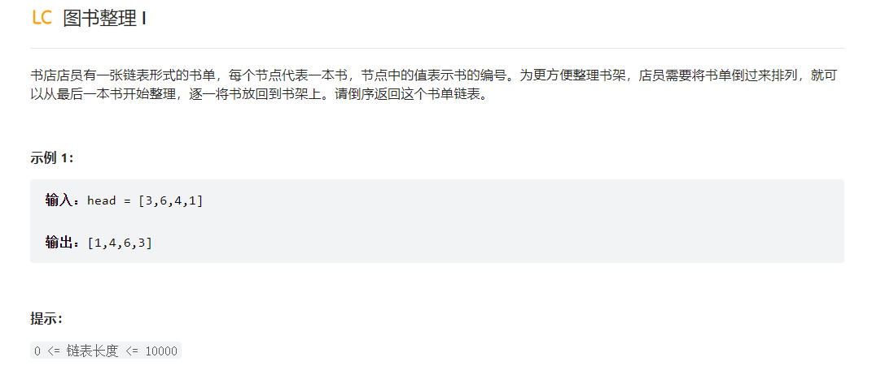

# 在这之前，先对链表相关知识进行复习:

    package dailyStrucEx.ex1;/*
    @Create 2024/5/15
    @Author Wang
    */

    import java.util.ArrayList;

    // definition of a list
    public class ListNode {
        int val;
        ListNode next;
        ListNode() {}
        ListNode(int val) { this.val = val; }
        ListNode(int val, ListNode next) { this.val = val; this.next = next; }

        // 创建链表，用头插法
        public ListNode createSinglyLinkList_Backward(int[] data){
            ListNode head = new ListNode();

            for (int d : data){
                ListNode newNode = new ListNode(d, null);
                newNode.next = head.next;   // 先把前面结点的next设置为新结点的next,然后把新结点设置为头结点的next
                head.next = newNode;
            }
            return head;
        }
        // 遍历链表
        public ArrayList<Integer> traversalLinkList(ListNode head){
            ArrayList<Integer> data_store = new ArrayList<>();
            head = head.next;   //头结点是不含数值的,仅有指针
            while(head != null){
                data_store.add(head.val);
                head = head.next;
            }
            return data_store;
        }
    }